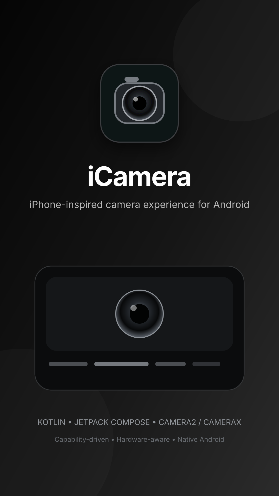

# iCamera

<p align="center">
  
</p>

<p align="center">
  <strong>An iPhone-inspired Android camera built with Kotlin + Jetpack Compose.</strong>
</p>

## About

iCamera aims to recreate the **iPhone Camera experience on Android** while using the camera hardware actually available on the user's device.

The app is **capability-driven**: features are discovered at runtime and the UI adapts accordingly.

For example:

- Ultra-wide controls appear only when an ultra-wide camera is available.
- High-megapixel capture is offered only when supported.
- Video resolution and frame-rate options come from the device's supported configurations.
- Zoom controls adapt to the available lenses and zoom range.
- Stabilization, HDR, RAW, flash, torch, manual controls, and other features appear only when supported.
- Unsupported features are hidden instead of pretending every Android device has the same hardware.

The goal is a consistent iPhone-like camera experience without sacrificing Android hardware capabilities.

## Goals

- Recreate the core iPhone Camera UI and interaction model.
- Use native Android camera capabilities to their full practical extent.
- Adapt the UI to different camera hardware automatically.
- Support single-camera, multi-camera, and flagship devices.
- Keep the camera experience fast, responsive, and reliable.
- Build the camera system so new hardware capabilities can be added without rewriting the UI.

## Tech Stack

- **Kotlin**
- **Jetpack Compose**
- **CameraX**
- **Camera2**
- **Android MediaStore**

CameraX will handle common camera workflows where appropriate. Camera2 will be used where lower-level hardware information or advanced camera control is required.

## Camera Capabilities

iCamera will discover capabilities at runtime, including where available:

- Front / rear cameras
- Wide / ultra-wide / telephoto lenses
- Logical and physical cameras
- Zoom range and lens switching
- Sensor resolution
- Supported photo resolutions
- Supported video resolutions
- Supported frame rates
- HDR
- Stabilization
- Flash and torch
- RAW / DNG
- Focus and exposure controls
- Other camera capabilities exposed by the device

### Capability-driven UI

The UI should never be based on device names.

Instead:

```text
Camera Hardware
      ↓
Capability Detection
      ↓
Capability Model
      ↓
Camera State
      ↓
Compose UI
```

A feature should be shown only when its required capability is available and the selected configuration supports it.

## Camera Experience

The main camera screen will focus on the familiar iPhone Camera layout:

- Full-screen preview
- Minimal top controls
- Flash / torch
- Camera switching
- Adaptive zoom controls
- Photo / video modes
- Shutter control
- Front/rear camera switching
- Recent media preview
- Contextual camera controls
- Device-dependent features

The UI should remain visually consistent even when the underlying hardware differs significantly.

## Photo

Target photo capabilities include:

- Standard high-quality capture
- Maximum supported resolution
- Ultra-wide and telephoto capture
- HDR
- RAW / DNG
- Flash
- Timer
- Burst capture
- Focus and exposure controls
- Aspect-ratio controls
- EXIF and orientation metadata

Only capabilities supported by the current device should be exposed.

## Video

Video configuration should be generated from actual device support.

Potential options include:

- 1080p
- 4K
- Higher resolutions when supported
- 24 / 30 / 60 FPS
- High-frame-rate video
- HDR video
- Stabilized video
- Device-supported codecs and configurations

The app must account for **valid combinations** of resolution, frame rate, lens, HDR, and stabilization rather than checking each option independently.

## Architecture

The camera engine and UI should remain separate.

```text
Compose UI
   ↓
Camera ViewModel / State
   ↓
Camera Domain
   ↓
Camera Abstraction
   ↓
CameraX / Camera2
   ↓
Android Camera Hardware
```

The capability system is a core part of the architecture and should be the single source of truth for hardware-dependent UI.

## Hardware Adaptation

The same application should scale from:

**Basic phone**

Single camera, standard photo/video controls.

**Multi-camera phone**

Wide, ultra-wide, telephoto, adaptive zoom and device-specific features.

**Flagship phone**

High-resolution capture, advanced stabilization, HDR, high-frame-rate video, RAW and other supported capabilities.

No device-specific feature should require hardcoding a particular phone model.

## Development

### Requirements

- Android Studio
- Kotlin
- Android SDK
- Physical Android device for camera testing

### Clone

```bash
git clone https://github.com/hustlewithvikram/i-camera.git
cd i-camera
```

Open the project in Android Studio and run it on a physical Android device.

Camera behavior should be tested on real hardware because emulator capabilities do not represent the full Android camera ecosystem.

## Roadmap

### Foundation

- [ ] Android project setup
- [ ] Compose camera screen
- [ ] Camera permissions
- [ ] Camera preview
- [ ] Photo capture
- [ ] Video capture
- [ ] MediaStore integration

### Camera Intelligence

- [ ] Camera discovery
- [ ] Capability model
- [ ] Lens detection
- [ ] Zoom mapping
- [ ] Resolution discovery
- [ ] Frame-rate discovery
- [ ] Stabilization detection
- [ ] Flash / torch detection
- [ ] RAW detection
- [ ] Valid camera-configuration detection

### iPhone-like UX

- [ ] Camera UI
- [ ] Mode selector
- [ ] Zoom controls
- [ ] Shutter interaction
- [ ] Camera switching
- [ ] Animations
- [ ] Haptics
- [ ] Gestures
- [ ] Dynamic controls

### Advanced Capture

- [ ] High-resolution capture
- [ ] HDR
- [ ] RAW / DNG
- [ ] Advanced stabilization
- [ ] High-frame-rate video
- [ ] HDR video
- [ ] Advanced focus / exposure
- [ ] Burst capture
- [ ] Image processing

### Compatibility & Polish

- [ ] Multi-device testing
- [ ] Camera combination testing
- [ ] Performance optimization
- [ ] Error handling
- [ ] Accessibility
- [ ] Localization
- [ ] Release configuration

## Engineering Principles

1. **Hardware is the source of truth.**
2. **Never hardcode capabilities to a device model.**
3. **Never show a feature that the current camera configuration cannot support.**
4. **Keep camera implementation separate from Compose UI.**
5. **Prefer runtime capability detection over assumptions.**
6. **Test camera features on physical devices.**
7. **Prioritize capture reliability and performance.**

## Disclaimer

iCamera is an independent Android project inspired by the interaction model and visual language of smartphone camera applications. It is not affiliated with Apple Inc.

## License

License information will be added when the project's licensing decision is finalized.
